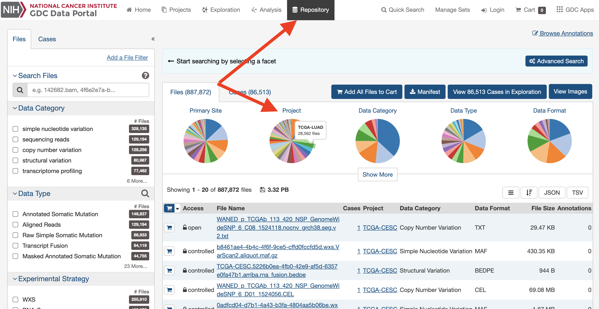
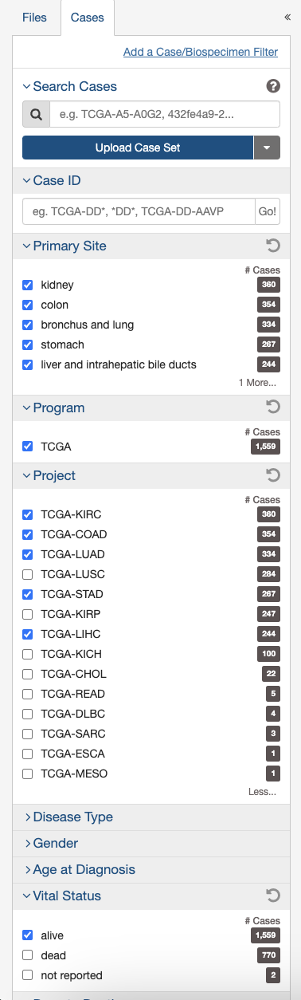
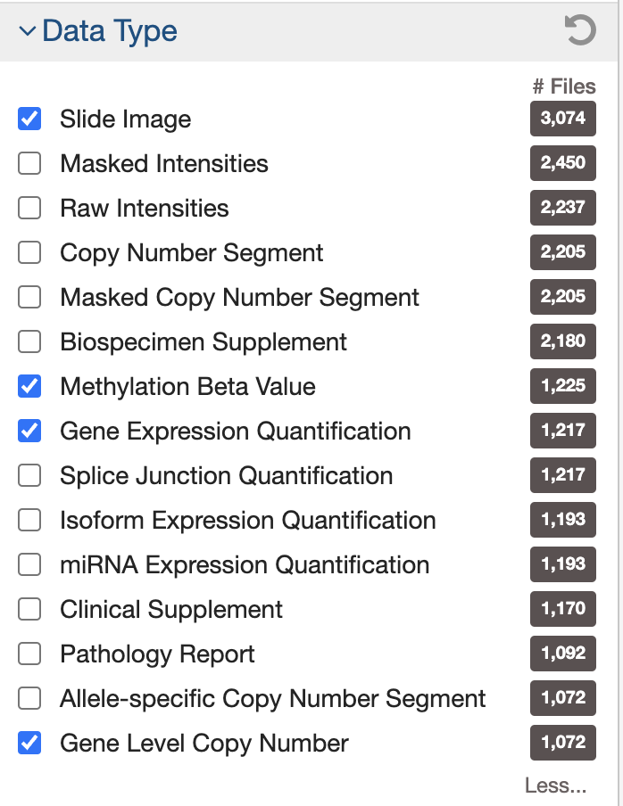
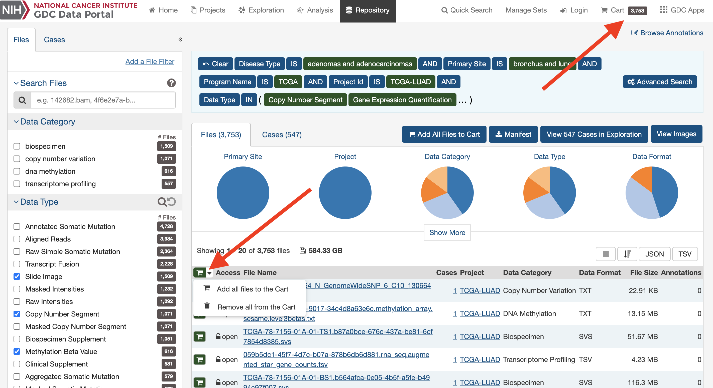
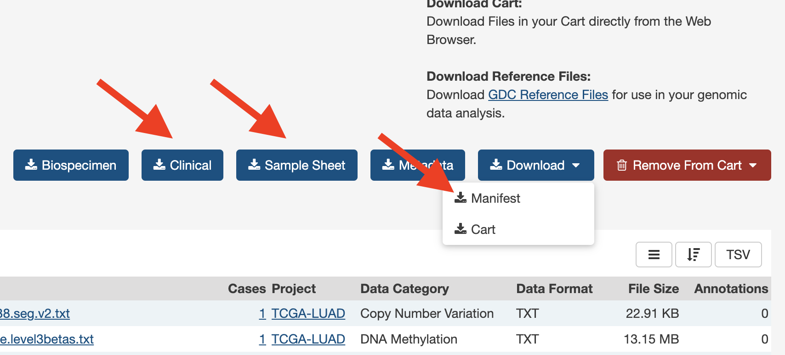

# Intstructions for multi-modal learning using the TCGA Data

This project provides a preprocessing, data organization, and modeling framework to predict the type of cancer patients have using data collected from [The Cancer Genome Atlas](https://www.cancer.gov/ccg/research/genome-sequencing/tcga). The Cancer Genome Atlas provides publicly available data through the [GDC (Genomic Data Commons) Data Portal](https://portal.gdc.cancer.gov/). 

### 1. Downloading a dataset
The datasets used in this paper are from TCGA's LUAD, KIRC, LIHC, STAD, and COAD Projects (https://portal.gdc.cancer.gov/projects/). All datasets share the same modalities used in *Sun et. al*: **Copy Number Variation, Epigenetic, Clinical, Transcriptomic, and Imaging**. See [here](#information-about-modalities) for descriptions of the modalities. These five modalities will be used for this project's analysis. Any dataset from TCGA on the GDC data portal can be downloaded and used for a similar type of analysis. To download a dataset with these five modalities, please follow these steps.

1. Navigate to the [GDC data portal](https://portal.gdc.cancer.gov/repository) and select the 'Repository' tab at the top.
2. Select a project.

3. On the left-hand menu, under the cases tab, make sure to select a specific disease for the study if multiple are present. Under the files tab, under data type, select "Slide Image," "Gene Level Copy Number," "Methylation Beta Value," and "Gene Expression Quantification." These correspond to the imaging, CNV, DNA methylation (epigenetic), and gene expression (transcriptomic) modalities respectively. Note that for this paper, we further filtered for patients that were alive to create a more balanced combined dataset (navigate to Cases -> Vital Status). 
<p text-align="center">
  
   
</p>

4. Next, click on the small shopping cart icon and add all files to cart. Click the cart icon in the top right corner. 

5. All the relevant files should be listed in the cart now. Now, install the **Sample Sheet**, **Clinical**, and the **Manifest** files. The sample sheet is a table that maps each of the cases to the files and gives descriptions about what modality each file belongs. The clinical data has information about the patients and includes the survival data. The manifest file contains a set of file UUIDs and will be used to instruct an API to download the data we have filtered.
 
6. Next, we will pass the manifest file to the GDC Data Transfer Tool Client. [Download the tool here](https://gdc.cancer.gov/access-data/gdc-data-transfer-tool). If using Ubuntu/Linux, the executable for the tool client can be called using the following command line syntax:
```shell
# cd into the directory to download data
cd ~/<PATH TO DOWNLOAD RAW DATA>/
# go to where the gdc client is downloaded, and specify the manifest file in the final argument
/<PATH TO GDC-CLIENT>/gdc-client download -m  /<PATH TO MANIFEST FILE>/manifest_file.txt
```
7. The download should now begin!
### 2. Reorganizing the data
The download from the data transfer tools downloads each file into its own individual folder. Using the sample sheet, we can reorganize the files so that each file belongs in a folder corresponding to the case it is associated with. We name the folders by Case ID, and each case folder has subdirectories corresponding to the modalities of study, and each of those folders contains data files.
To reorganize the data, use the notebook found in `data_setup/data_setup.ipynb`. 

### 3. Preprocessing modalities
The repository contains preprocessing for the five modalities aforementioned. Details about the preprocessing can be found in `preprocessing/README.md`. Running each of the notebooks should prepare a set of csv files that joins data by case across each of the modalities. 
After the notebooks are run, we found the intersection of patients who had all five modalities and put them into one dataset and then a train-test split can be created. Generally the number of cases that are used for the final analysis are reduced because some cases may lack data from one or more of the modalities. As a result, it is important to create a split once all the filtering has been completed. Lastly, we create pytorch tensors for each modalitiy. 

### 4. Training and hyperparameter tuning.

Unimodal:
To train and tune for a single modality model, use `modeling/training_one_hyper.py`. This allows you to train a neural network for any one of the tabular modalities and a CNN for the imaging modality, and do hyperparameter tuning using weights and biases (example config can be found in `common_files/config.json`). 

Multi-modal:
To train on all five modalities, use `modeling/training_five_hyper.py` which will do hyperparameter tuning using weights and biases (example config can be found in `common_files/config.json`). You can train using a concatenation model, a pairwise cross-modal attention model, and our OvO model. 

### 5. Evaluation

Unimodal:
To evaluate for a single modality model, use `modeling/evaluate_one.py`. This allows you to a neural network for any one of the tabular modalities and a CNN for the imaging modality, using the best hyperparameters found in the training step. 

Multi-modal:
To evaluate on all five modalities, use `modeling/evaluate_five.py`. This allows you to evaluate using the best hyperparameters found in the training step. 


### Information about modalities
1. **Copy Number Variation** - Copy number variation defines varying number of repeats of genetic fragments found in a human genome. The number of repeats of specific genetic fragments influences gene expression levels and has been associated with the progression of different cancers. [Erdem et. al.](https://onlinelibrary.wiley.com/doi/10.1002/mc.22664)
2. **Epigenetic** - Epigenetic data is collected through DNA methylation beta values. DNA methylation represents the amount of condensation of genetic regions due to the chemical alteration imposed by methyl groups. This condensation generally represses gene activity near the genetic region. 
3. **Clinical** - Clinical data is collected for each patient and includes information such as the patient diagnosis, demographics, exposures, laboratory tests, and family relationships.
4. **Transcriptomic** - Transcriptomic data is collected through RNA-sequencing. Levels of gene expression are recorded by detecting the amounts of transcripts found for each gene. These levels can be used to determine the molecular mechanisms underlying the cancer.
5. **Imaging** - TCGA collects pathology slide images of tissues sampled from the tumor. This modality provides visual information about the malignant region and can help with diagnosis and treatment planning.
